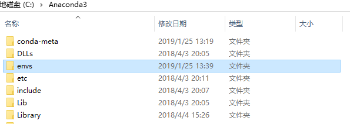
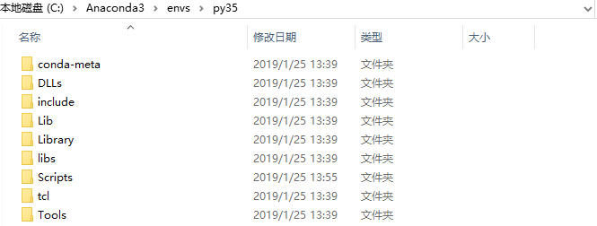
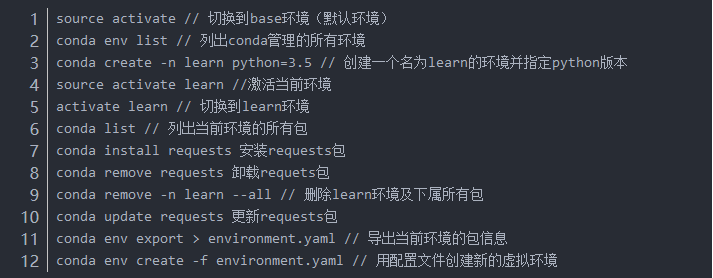

## 1.1、管理环境
- 语法：conda create -n env_name list of packages
- 解释：-n env_name设置环境的名称(-n 指名称)，而 list of packages 是要安装在环境中的包的列表
- Python: conda create -n py python=3.3,创建具有特定版本的PYthon版本(=左右不要有空格)
## 1.2、进入环境

- Linux上使用source activate my_env进入环境，windows上使用active my_env进入环境。
- 进入环境后，环境名称：(my_env)~$。conda list检查包。离开环境:Linux上使用source deactivate，windows上使用deactivate。

## ubuntu环境下
- 打开终端输入python，进入的是anaconda自带的base环境下的python
- 如果该python，不是我们想要的版本，那么就需要创建独立的虚拟环境
### 创建独立的python环境

- 语法：打开终端输入:conda create -n learn python=3.5
- 解释: 创建一个名称为learn的虚拟环境，并指定使用python3.5版本(conda会自动找版本下载。)
### 切换环境
- 语法： source activate learn
- 解释: 切换到learn的虚拟环境
- 语法： conda env list
- 解释：查看全部环境（若忘记创建的环境名称，可以通过此方法查看）
### 给独立环境安装第三方包
直接打开终端，切换环境，之后终端前面出现learn的标识符，代表我们进入了learn虚拟环境

- 语法：conda install requests(或者 pip install requests)
- 语法：pip uninstall requests
### 导入导出环境
>在anaconda里面使用了独立的环境来开发项目，项目开放完成以后，需要把项目所需环境导出，以便迁移。也可以导入别人的环境，然后自己的机器里面就有了项目所需要的环境。
- 语法：conda env export > environment.yaml
- 解释：进入learn环境，导出，可是是xxx.yaml或者xxx.properites
- 语法：conda env create -f environment.yaml
- 解释：创建一个相同的虚拟环境，导入
### 删除整个虚拟环境

- 语法：conda remove -n your_env_name(虚拟环境名称) --all

### ***创建的环境保存在本地哪儿呢？***
>Anaconda文件夹：这里就是base环境，里面有有一个基本的python解释器，***envs文件夹***是自己创建的各种虚拟环境的入口

>点开envs之后，可以看到py35的虚拟环境的文件夹，再点进去就是一个标准的python环境目录

#### ubuntu使用anaconda常用命令

