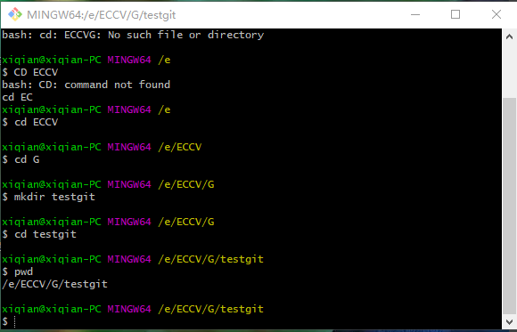
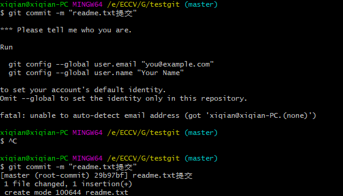
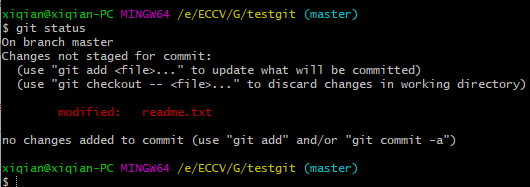
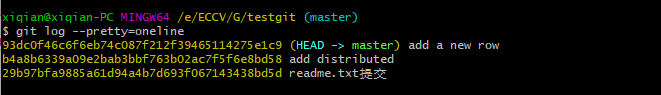

# git
 [git教程命令](https://www.liaoxuefeng.com/wiki/896043488029600)
## 1.1、创建版本库
1 .创建一个空目录

  
2 .使用***git init***命令将新建的上述目录变成git可以管理的仓库

- 空库建好后，该目录里面会出现.git的目录，是Git用来跟踪管理版本库的。

## 1.2、添加文件到git仓库
在版本库testgit目录下新建一个文件

- 使用命令 ***git add readme.txt***告诉git，把文件添加到仓库（暂存区），可反复多次使用，添加多个文件。
- 使用命令***git commit***告诉git，把文件提交到仓库（从暂存区提交到当前分支），commit 可以一次提交很多文件,-m输入的是说明
---
***git错误1***

- 解决方法：找到工程目录 (Project) 的.git文件夹，打开之后找到config文件，在最后边加上一句话
[user]
email=your email
name=your name
---
- git commit命令执行成功后会告诉，***1 file change***:1个文件被改动(我们新添加的readme.txt文件)；
***1 inserions***:插入一行内容(readme.txt有一行内容)

## 2.1、修改文件
### 2.1.1、git status - 是否修改

- 修改了readme文件之后，可以通过***git status***看结果
- 它可以掌握仓库的状态，通过上图我们知道txt文件被修改了，但还没有准备提交的修改。
### 2.1.2、git diff 文件  - 查看修改内容

(第一行后面添加了换行，所以算修改？后面三行都是新添加的内容) 
- git add readme.txt之后，git status可知，将要被提交的修改包括readme.txt
- git commit之后，可以看到git statu的结果，没有需要提交的修改，而且工作目录是干净的。
## 2.2、退回版本
### 2.2.1、git log 

- 查看历史记录,确定回退到哪个版本
- git log 显示从最近到最远的提交日志，例如最新提交的版本说明‘add a new row’
- ***git log --pretty=oneline***，精简输出日志

### 2.2.2、git reset 

- 启动回退，HEAD表示当前版本，上一个版本HEAD^,上上一个版本就是HEAD^^,100的话可以写成HEAD~100
#### 2.2.3、git rset --hard commit_id

- 回到未来 -未关机。commit后面的数字是commit id版本号，可通过这个（版本号不用写全，前几位就可以）回到之后的版本。（可以向上找到版本号）
#### 2.2.4、git reflog 

- 回到未来 -已关机。当使用$git reset --hard HEAD^回退到add distributed版本时，想恢复到add a new line，需要知道它的id。git reflog 用来记录每一次命令

## 3.1、管理修改

- 第一次修改 -》git add -》第二次修改 -》git add -》git commit
- 对于每次的修改，如果不存入暂存区(git add)，就不会加入到commit中。（git diff HEAD -- readme.txt查看工作区和版本库里最新版本的区别）

## 4.1、撤销修改
- 语法：git checkout -- readme.txt。
- 作用：把readme.txt文件在**工作区**的修改全部撤销。让文件回到最近一次git commit或git add时的状态。
- 语法：git reset HEAD readme.txt
- 作用：可以将添加到**暂存区**（git add readme.txt），但未提交的文件，将暂存区的修改撤销，重新放回工作区。
- 语法：git reset --hard HEAD^
- 作用：**版本库**修改,使用版本回退的方法，详情2.2

- git reset命令既可以回退版本，也可以把暂存区的修改回退到工作区。
- 通过上图，使用git status查看状态，发现两个()代表暂存区为空，工作区有修改（刚才添加的句子）。

## 5.1、删除文件
- 语法：rm test.txt
- 作用：从工作区删除(在testgit文件夹中不存在)
- 语法：git rm test.txt
- 作用：从版本库中删除该文件(使用git rm删掉，并且git commit)
- 语法：git checkout -- test.txt
- 作用：如果删错了，且版本库还有，可以将误删的文件恢复到最新版本(会丢失最近一次提交后修改的内容)

- **从来没有被添加到版本库就被删除的文件，无法恢复！**

