# git
 [git教程命令](https://www.liaoxuefeng.com/wiki/896043488029600)
## 1.1、创建版本库
1 .创建一个空目录

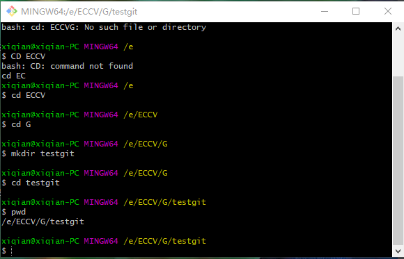
  
2 .使用***git init***命令将新建的上述目录变成git可以管理的仓库

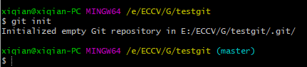

- 空库建好后，该目录里面会出现.git的目录，是Git用来跟踪管理版本库的。

## 1.2、添加文件到git仓库
在版本库testgit目录下新建一个文件

- 使用命令 ***git add readme.txt***告诉git，把文件添加到仓库（暂存区），可反复多次使用，添加多个文件。
- 使用命令***git commit***告诉git，把文件提交到仓库（从暂存区提交到当前分支），commit 可以一次提交很多文件,-m输入的是说明
---
***git错误1***

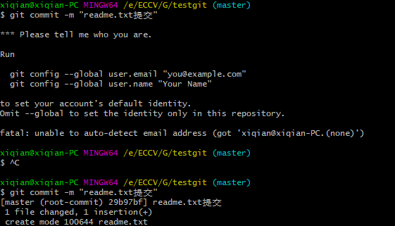

- 解决方法：找到工程目录 (Project) 的.git文件夹，打开之后找到config文件，在最后边加上一句话
[user]
email=your email
name=your name
---
- git commit命令执行成功后会告诉，***1 file change***:1个文件被改动(我们新添加的readme.txt文件)；
***1 inserions***:插入一行内容(readme.txt有一行内容)

## 2.1、修改文件
### 2.1.1、git status - 是否修改

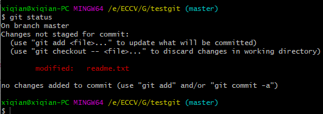
- 修改了readme文件之后，可以通过***git status***看结果
- 它可以掌握仓库的状态，通过上图我们知道txt文件被修改了，但还没有准备提交的修改。
### 2.1.2、git diff 文件  - 查看修改内容

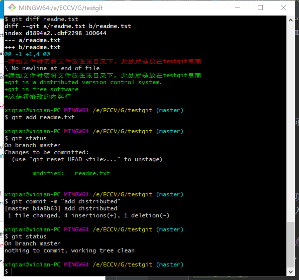

(第一行后面添加了换行，所以算修改？后面三行都是新添加的内容) 
- git add readme.txt之后，git status可知，将要被提交的修改包括readme.txt
- git commit之后，可以看到git statu的结果，没有需要提交的修改，而且工作目录是干净的。
## 2.2、退回版本
### 2.2.1、git log 

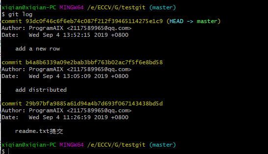
- 查看历史记录,确定回退到哪个版本
- git log 显示从最近到最远的提交日志，例如最新提交的版本说明‘add a new row’
- ***git log --pretty=oneline***，精简输出日志

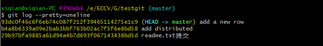
### 2.2.2、git reset 
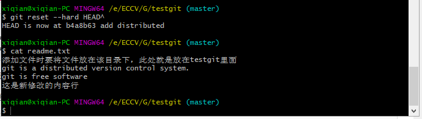
- 启动回退，HEAD表示当前版本，上一个版本HEAD^,上上一个版本就是HEAD^^,100的话可以写成HEAD~100
#### 2.2.3、git rset --hard commit_id
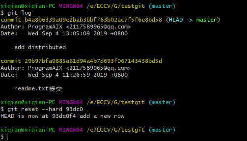
- 回到未来 -未关机。commit后面的数字是commit id版本号，可通过这个（版本号不用写全，前几位就可以）回到之后的版本。（可以向上找到版本号）
#### 2.2.4、git reflog 

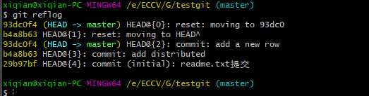
- 回到未来 -已关机。当使用$git reset --hard HEAD^回退到add distributed版本时，想恢复到add a new line，需要知道它的id。git reflog 用来记录每一次命令

## 3.1、管理修改

- 第一次修改 -》git add -》第二次修改 -》git add -》git commit
- 对于每次的修改，如果不存入暂存区(git add)，就不会加入到commit中。（git diff HEAD -- readme.txt查看工作区和版本库里最新版本的区别）

## 4.1、撤销修改
- 语法：git checkout -- readme.txt。
- 作用：把readme.txt文件在**工作区**的修改全部撤销。让文件回到最近一次git commit或git add时的状态。
- 语法：git reset HEAD readme.txt
- 作用：可以将添加到**暂存区**（git add readme.txt），但未提交的文件，将暂存区的修改撤销，重新放回工作区。
- 语法：git reset --hard HEAD^
- 作用：**版本库**修改,使用版本回退的方法，详情2.2

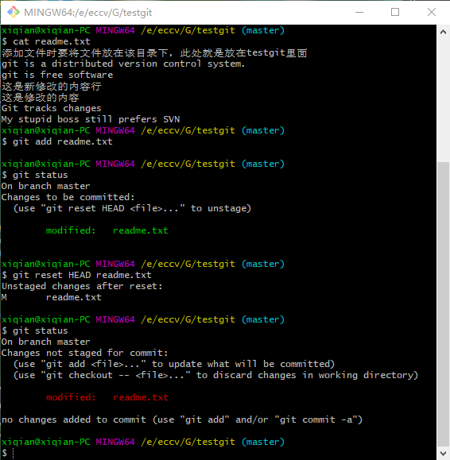
- git reset命令既可以回退版本，也可以把暂存区的修改回退到工作区。
- 通过上图，使用git status查看状态，发现两个()代表暂存区为空，工作区有修改（刚才添加的句子）。

## 5.1、删除文件
- 语法：rm test.txt
- 作用：从工作区删除(在testgit文件夹中不存在)
- 语法：git rm test.txt
- 作用：从版本库中删除该文件(使用git rm删掉，并且git commit)
- 语法：git checkout -- test.txt
- 作用：如果删错了，且版本库还有，可以将误删的文件恢复到最新版本(会丢失最近一次提交后修改的内容)

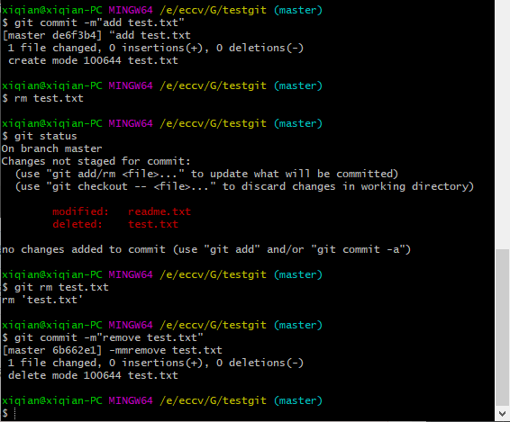
- **从来没有被添加到版本库就被删除的文件，无法恢复！**

## 6.1 远程仓库
### 关联
> 已经在本地创建了一个Git仓库后，想在GitHub创建一个Git仓库，并且让两个仓库进行远程同步，这样，GitHub上的仓库既可以作为备份，又可以让其他人通过该仓库来协作。
> 在GitHub上创建一个新库，可以从这个仓库克隆出新的仓库，也可以把一个已有的本地仓库与之关联，然后，把本地仓库的内容推送到GitHub仓库。
- 语法： git remote add origin git@github.com:ProgramAIX/testgit.git
-        git remote add origin git@server-name:path/repo-name.git
- 作用:本地关联GitHub远程库，添加后，远程库的名字就是origin
###  推送
- 语法:git push -u origin master
- 作用：把本地库的所有内容推送到远程库上，实际上是把当前分支master推送到远程。由于远程库是空的，第一次推送master分支时，加上了 -u 参数，
#### 错误

- 会在本地C:\Users\你的用户名.ssh生成文件夹，里面有id_rsa和id_rsa.pub两个文件 ,然后复制id_rsa.pub文件里面的内容，到https://github.com/settings/keys新建一个

- 之后，只要本地作了提交，就可以通过下面的命令，把本地master分支的最新修改推送至GitHub(本地提交推送到远程库)
- 语法：git push origin master  （git push origin master 推送到其他分支，例如dev）

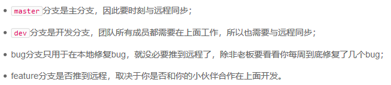

###6.1.0
1. 创建SSH key.
   - 用户主目录下，.ssh目录，其中是否存在id_rsa和id_rsa.pub文件。若没有，则打开shell（Git Bash），创建ssh key:
   ssh-keygen -t rsa -C "youremail@example.com"
   生成的上述两个文件，分别是私钥和公钥。
2. 登录，打开settings-ssh keys 页面-add ssh key- 填上任意title ,在key文本文本框里面粘贴id_rsa.pub文件内容。-add key  

### ***SSH警告***
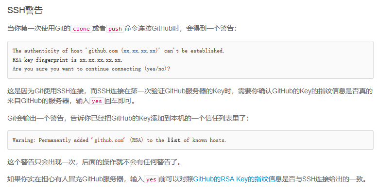

### ***从远程库克隆***
>上面是现有本地库，后有远程库，然后关联
 现在，假设从零开始，最好的方式是先创建远程库，然后，从远程库克隆。
- 首先，登录github，创建一个新的仓库，名字gitskills：勾选Initialize this repository with a README
- 其次，现在远程库建好了，下一步使用命令git clone 克隆一个本地库

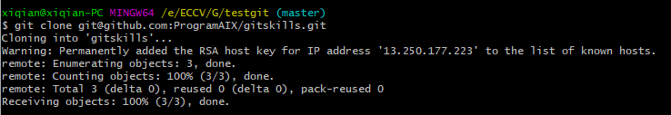
- 然后进入gitskills目录查看，已经有README.md文件了

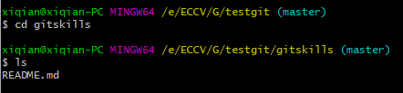
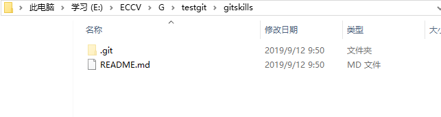

## 7.1 分支管理
### 创建与合并分支
- 语法：git checkout -b dev  （git branch dev  git checkout dev）
- 作用：创建dev分支，然后切换到dev分支.-b表示创建并切换，相当于上面的两条命令。*表示当前分支。

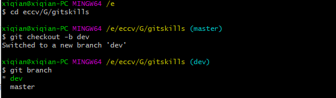
- 语法：git checkout master
- 当分支dev工作完成，切换回master
> 切换回master分支后，将无法查看readme.txt文件，因为那个提交是在dev分支上，而master分支此刻的提交点并没有变。
- 语法：git merge dev
- 作用：git merge命令用于合并指定分支到当前分支

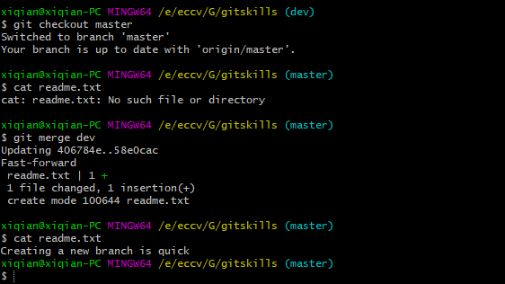
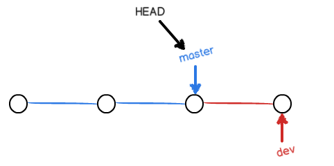
- 语法：git branch -d dev  
- 作用：合并完成之后，可以删除dev分支
- 语法：git switch -c dev
- 作用: 创建并切换到dev分支  
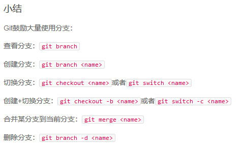
### 解决冲突
- 分别在master和新分支feature1上给出新的提交，再合并时：
> git merge feature1
Auto-merging readme.txt
CONFLICT (content): Merge conflict in readme.txt
Automatic merge failed; fix conflicts and then commit the result.
#### Bug 分支
>若当前在dev上进行的工作还没有提交，想要创建一个新的分支来修复bug
- 语法： git stash
- 作用: 把当前工作储藏起来，等以后恢复现场后继续工作